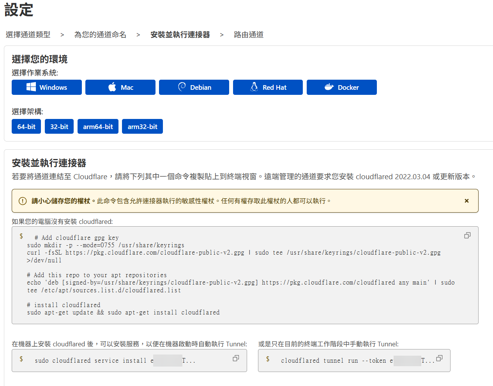

# Cloudflare Tunnel 內網穿透（可選）

<figure><figcaption></figcaption></figure>

1. 購買域名，解析到[Cloudflare](https://dash.cloudflare.com/)上
2.  在控制台選擇\[Zero Trust]

    <figure><figcaption></figcaption></figure>
3.  選擇 \[網路]->\[連接器]->\[建立通道]

    <figure><figcaption></figcaption></figure>
4.  選擇\[Cloudflared]

    <figure><figcaption></figcaption></figure>
5.  為通道起名，如`my_computer`

    <figure><figcaption></figcaption></figure>
6.  根據網頁說明安裝連接器，然後連接到Tunnel

    
<figure><figcaption></figcaption></figure> <figure><figcaption></figcaption></figure>

